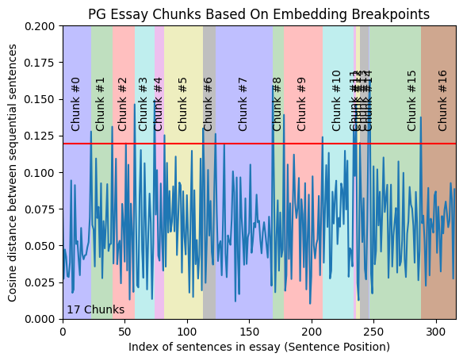

# Semantic Chunker

## Overview

The Semantic Chunker uses AI embeddings to split text based on semantic relationships rather than fixed character counts. This approach is ideal for retrieval-augmented generation (RAG) applications where context preservation is crucial.

## Installation

```xml
<dependency>
  <groupId>io.jchunk</groupId>
  <artifactId>jchunk-semantic</artifactId>
  <version>${jchunk.version}</version>
</dependency>
```

```groovy
implementation group: 'io.jchunk', name: 'jchunk-semantic', version: "${JCHUNK_VERSION}"
```

## Configuration

```java
// using default config
SemanticChunker chunker = new SemanticChunker(new JChunkEmbedder());

// with custom config
Config config = Config.builder()
    .sentenceSplittingStrategy(SentenceSplittingStrategy.DEFAULT) // regex for splitting sentences
    .percentile(90)                                               // similarity threshold (1–99)
    .bufferSize(2)                                                // number of neighbors for context
    .build();

SemanticChunker chunker = new SemanticChunker(new JChunkEmbedder(), config);
```

### Configuration Options

- `sentenceSplittingRegex`: Regex used to split text into sentences. Can be provided directly or via a `SentenceSplittingStrategy`. 
  - Default: `SentenceSplittingStrategy.DEFAULT`.
- `percentile`: Percentile threshold (1–99) applied to cosine distance scores to determine breakpoints. Higher values -> fewer and larger chunks. Lower values -> more and smaller chunks. 
  - Default: `95`.
- `bufferSize`: Number of neighboring sentences to include on each side when creating the context window. Must be > 0. 
  - Default: `1`.

## How It Works

### Sentence Splitting
Split the entire text into sentences using delimiters like `.`, `?`, and `!` (alternative strategies can also be used).

### Mapping Sentences
Transform the list of sentences into an indexed structure (pre-chunking):

```json
[
  { "sentence": "this is the sentence.", "index": 0 },
  { "sentence": "this is the next sentence.", "index": 1 },
  { "sentence": "this is the last sentence.", "index": 2 }
]
```

### Combining Sentences
Combine each sentence with its preceding and succeeding sentences (the number of sentences is controlled by `bufferSize`) to reduce noise and better capture relationships. Add a `combined` field for this text.

Example for buffer size 1:

```json
[
  {
    "sentence": "this is the sentence.",
    "combined": "this is the sentence. this is the next sentence.",
    "index": 0
  },
  {
    "sentence": "this is the next sentence.",
    "combined": "this is the sentence. this is the next sentence. this is the last sentence.",
    "index": 1
  },
  {
    "sentence": "this is the last sentence.",
    "combined": "this is the next sentence. this is the last sentence.",
    "index": 2
  }
]
```

### Generating Embeddings
Compute the embedding of each `combined` text.

```json
[
  {
    "sentence": "this is the sentence.",
    "combined": "this is the sentence. this is the next sentence.",
    "embedding": [0.002, 0.003, 0.004],
    "index": 0
  }
]
```

### Calculating Distances
Compute the cosine distances between sequential pairs.

### Identifying Breakpoints
Analyze the distances to identify sections where distances are smaller (indicating related content) and areas with larger distances (indicating less related content).

### Determining Split Points
Use the 95th percentile of the distances as the threshold for determining breakpoints (can use any other percentile or threshold technique).



Note: Image taken from this [post](https://github.com/FullStackRetrieval-com/RetrievalTutorials/blob/main/tutorials/LevelsOfTextSplitting/5_Levels_Of_Text_Splitting.ipynb).

### Splitting Chunks
Split the text into chunks at the identified breakpoints.

## Advantages

- Preserves semantic context
- Adapts to content structure
- Better for RAG applications
- Reduces information loss

## Disadvantages

- Needs an embedding model (the system must be able to handle it to avoid performance issues)

## Requirements

- ONNX Runtime for embedding generation
- Pre-trained embedding model (included in the module)
- By default `all-minilm-l6-v2` is used

## Acknowledgments

This module is inspired by Greg Kamradt's [text splitting ideas](https://github.com/FullStackRetrieval-com/RetrievalTutorials/blob/main/tutorials/LevelsOfTextSplitting/5_Levels_Of_Text_Splitting.ipynb).
